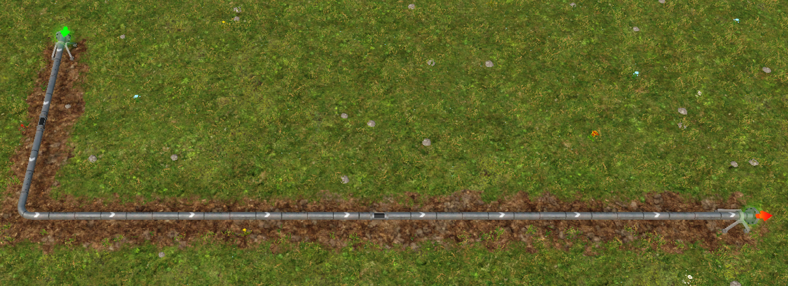

# Captain-of-Industry-COI-Tweaks

## Overview

Some Vanilla-ish Tweaks for Captain of Industry, with multiple components that you can configure (or fully disable) at will.

## Installation

1. Download latest release from [https://github.com/Leyren/Captain-of-Industry-COI-Tweaks/releases/latest](https://github.com/Leyren/Captain-of-Industry-COI-Tweaks/releases/latest)
2. Unpack the `.zip` in your mod folder (usually `<your-user>\Documents\Captain of Industry\Mods`)
3. Mod should be located in `<your-user>\Documents\Captain of Industry\Mods\COITweaks\COITweaks.dll`
4. Adapt config `coitweaks_config.ini` as you want

Note: If you want to reset the config file, delete it and start a new game.

## Features
Take a look in the provided `coitweaks_config.ini`. Here you also find options to disable the specific components, if you don't want something applied.

### Pillar Tweaks
PillarTweaks adds a menu to the toolbar, that allows you to add / remove pillars at transports where you want them, instead of being limited to the automatic placement by the game.
Comes with 3 modes:

- Add: Select a start / end point on a transport to add pillars to the entire section
- Remove: Select a start / end point on a transport to remove pillars from the entire section
- Toggle: Click on a single tile of a transport to either add or remove a pillar directly

**NOTE**: Transports still require pillar support! Removing too many pillars and losing support will demolish your transport.

### Config Tweaks
ConfigTweaks overwrites internal fields to tweak certain game properties. (e.g. Pillar support radius)
**NOTE**: Use at your own risk - these fields are not intended to be modified, and some things may break or not work properly due to that
**NOTE**: If you want to start a new game WITHOUT these tweaks, RESTART YOUR GAME. The overrides apply throughout your entire game session, even if you start a new game with the mod disabled!

All config tweaks are located and explained in the `coitweaks_config.ini` file

Examples:
Modified Max Pillar Height:

Modified Support Radius:

